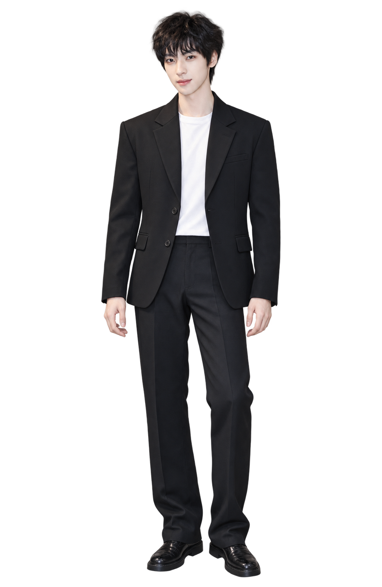

# 颜安 · Windows 互动角色

由 **Anbunensi** 制作的颜安粉丝向桌面互动角色。免费、非官方、非商业。

> 候选版已构建：完整资源与 Windows 自动交互测试通过。干净 Windows 10/11 人工验收尚未完成，尚未正式发布。详情见 [QA 报告](docs/QA_REPORT.md)。

按 [Super Idol Hub Windows 互动角色开发规范](https://github.com/super-idol-hub/idol-windows-character-guides) 制作。一个 EXE 内置一套完整造型：24 行、176 张 528 × 808 RGBA 关键帧和 314 组双向动作网格。

支持拖动受惊与松手恢复、双击挥手、16 方向凝视、随机待机、舞蹈、舞台、持久手机与睡眠动作、托盘、125%–400% 缩放和当前用户开机启动开关。开机启动默认关闭，角色不自动在桌面漫游。

- [用户使用说明](docs/USER_GUIDE.md)
- [人物及参考来源](docs/SOURCES.md)
- [权利与隐私](docs/RIGHTS.md)
- [构建说明](source/standalone/yanan/README.md)
- [项目清单](PROJECT-MANIFEST.json)
- [Windows 测试与构建下载](https://github.com/super-idol-hub/yanan/actions/runs/35840955207)
- [逐行动作预览](qa/evidence/contacts)
- [待完成的人工验收](docs/MANUAL_ACCEPTANCE.md)

参考照片不随仓库或程序分发。形象及动画为 AI 辅助创作，不代表艺人本人、工作室或任何平台认可。
